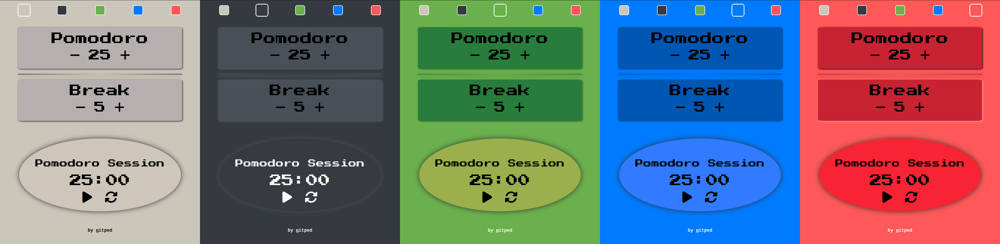

# Pomodoro Clock
A classic pomodoro clock aimed towards helping improve productivity.
The idea behind a pomodoro session is to have three consecutive work sessions of 25 min with two breaks of 5 min in between. 
This app allows for adjustable work and break sessions and includes multiple color themes.

## Notable Implementations
- Two adjustable timers that alternate countdowns.
- Buttons to pause/play, and reset timers.
- Alarm sound integration
- Five switchable color themes
- Unit testing

